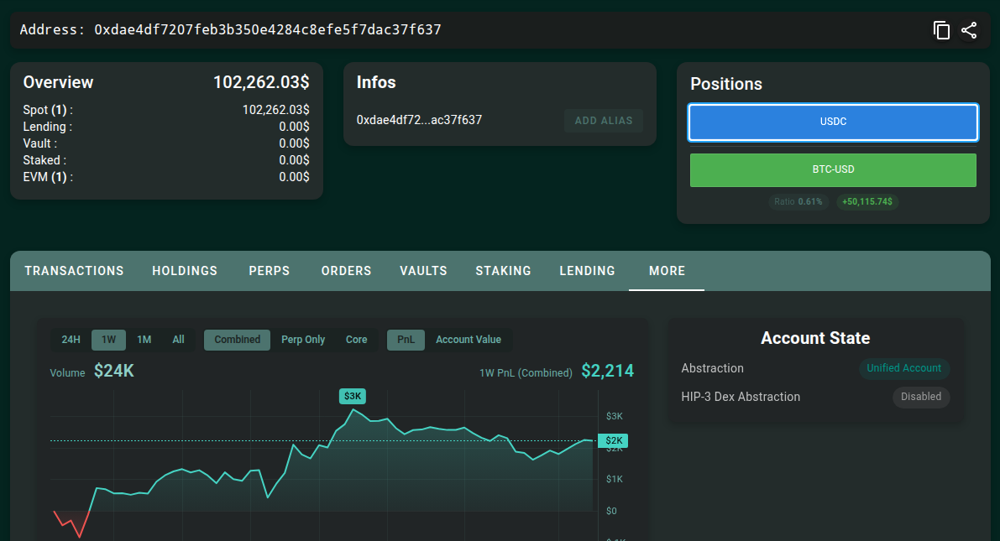

# hyper-grid

[English](./README.md) | **中文**

> 面向 [Hyperliquid](https://hyperliquid.xyz) 永续合约的本地网格交易桌面软件。

设定价格区间和投入后，程序会在现价下方挂买单、上方挂卖单，希望行情在区间内来回波动时赚取差价。

- **邀请链接**：[https://app.hyperliquid.xyz/join/MMREFCSI](https://app.hyperliquid.xyz/join/MMREFCSI) — 可减免手续费，作者也可获得奖励  
- **作者 Telegram**：[https://t.me/smith123_lee](https://t.me/smith123_lee) — 用着顺手也可联系了解高级版  

实盘账户如下：



## 运行演示

<video src="./images/running.mp4" controls width="100%"></video>

> 本程序可连接真实市场与真实资金，使用前请充分理解风险。建议先用 **模拟盘** 或 **测试网** 熟悉流程。

## 基本原理

网格交易把一段价格区间分成多层「格子」。程序大致这样工作：

1. **划定区间** — 设定价格下沿、上沿、格数与总投入；也可按现价 ±5% 快速填区间。
2. **挂出网格** — 相对实时中间价，低价侧挂 **买入**、高价侧挂 **卖出**。
3. **成交补单** — 买单成交后在更高价补卖单，卖单成交后在更低价补买单，靠区间内波动反复吃差价。
4. **风控与收尾** — 可设突破行为、最大回撤、单日亏损等；**停止**时会撤销全部挂单，并以市价平掉持仓。

软件**不会**帮你充值或提现。资金请在 Hyperliquid 官网自行管理。

## 快速开始

### 下载便携版（推荐）

不会编译代码时，请直接从 **[Releases](../../releases)** 下载预编译程序：

1. 按系统下载对应文件（无需安装包）：
   - **Windows** → `hyper-grid-windows-x64.exe`（双击运行）
   - **macOS 苹果芯片** → `hyper-grid-macos-arm64.app.tar.gz`（解压后打开 `.app`）
   - **macOS Intel** → `hyper-grid-macos-x64.app.tar.gz`（解压后打开 `.app`）
   - **Linux** → `hyper-grid-linux-x86_64.AppImage`，然后：
     ```bash
     chmod +x hyper-grid-linux-x86_64.AppImage
     ./hyper-grid-linux-x86_64.AppImage
     ```
2. 打开软件，建议先选 **模拟盘** 试跑。
3. 在顶栏切换 **中文 / EN**。

**Linux 说明：** AppImage 在 Ubuntu 22.04 上构建，需要较新的 glibc；**Ubuntu 20.04 无法运行**桌面版。

### 从代码运行

需要先安装 [Rust](https://rustup.rs) 和 [Node.js](https://nodejs.org/)（建议 20+）。

```bash
cd apps/desktop
npm install
npm exec tauri dev    # 启动桌面程序
```

Linux 还需安装 WebKit 等系统依赖（如 `libwebkit2gtk-4.1-dev`），否则无法编译桌面端。

## 实盘前需要准备

| 项目 | 说明 |
|------|------|
| Hyperliquid 永续账户资金 | 在官网自行充值。[主网](https://app.hyperliquid.xyz) · [测试网领水](https://app.hyperliquid-testnet.xyz/drip) |
| 钱包私钥 | 仅保存在本机可执行文件旁的 `.env`；模拟盘可不填 |

测试网 / 主网启动前必须填写私钥；私钥不要外传。

## 三步上手

1. **账户** — 选择运行模式（模拟盘 / 测试网 / 主网），实盘填写私钥后点 **刷新余额**。
2. **配置网格** — 选择交易对、价格区间、格数、总投入、杠杆等 → **预览网格** → **启动**。
3. **运行面板** — 查看状态、盈亏与成交；需要时 **暂停 / 恢复 / 停止**（停止会撤单并平仓）。

也可在配置页调整间距（等差 / 等比）、保证金模式（全仓 / 逐仓）、突破后行为，以及最大回撤、单日亏损等风控项；支持导入 / 导出策略配置。

## 常用配置说明

| 项目 | 说明 |
|------|------|
| 运行模式 | **模拟盘**（无真实资金）/ **测试网** / **主网** |
| 交易对 | Hyperliquid 永续列表（如 BTC），不做现货网格 |
| 价格下沿 / 上沿 | 网格覆盖的价格区间 |
| 网格数量 | 区间内分层层数（建议先用默认，再按习惯调整） |
| 总名义投入 | 计划投入的名义金额（USDC）；每格过小会无法启动 |
| 杠杆 | 放大收益与风险；越高越危险 |
| 突破后行为 | 价格冲出区间后：仅告警 / 暂停 / 撤单并暂停 |
| 最大回撤 / 单日亏损 | 触发后熔断，停止继续下单 |

## 安全提醒

- 加密货币与永续合约存在较高风险，可能导致资金损失；杠杆越高风险越大。
- 私钥仅保存在本机，请勿发给任何人，也不要提交到网盘或聊天工具。
- 务必先用模拟盘或测试网练习；主网请从小资金开始。
- 停止、关闭软件或重新启动前，程序会尝试撤单并平仓，请留意仓位与手续费。

## 免责声明

本软件仅供学习与研究，不构成任何投资建议。使用前请自行评估风险，并遵守 Hyperliquid 服务条款及当地法律法规。作者不对因使用本软件造成的任何损失承担责任。

## 开源协议

MIT
